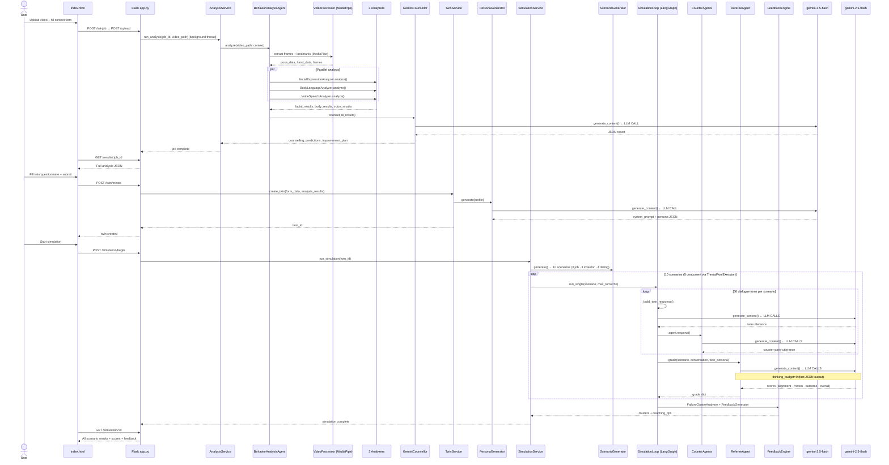
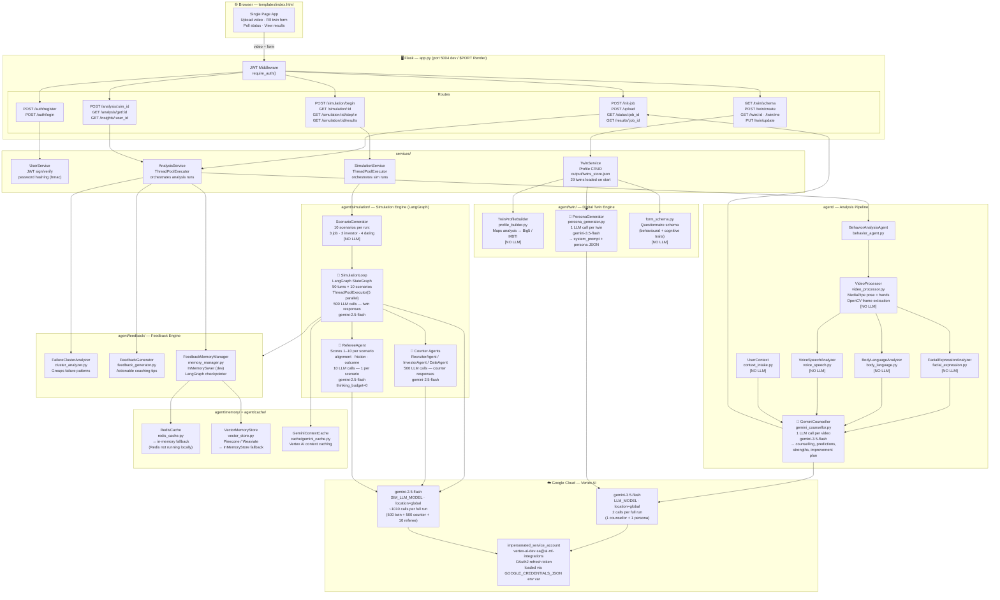

# HCA v2 — Current Architecture

## System Overview

HCA (Human Communication Agent) is an AI communication coach that:
1. Analyses a user's video (posture, facial expressions, voice)
2. Builds a **Digital Twin** persona from the analysis + a behavioural questionnaire
3. Runs **social simulations** (10 scenarios × 50 turns) against AI counter-parties
4. Scores each scenario and generates a personalised improvement plan

---

## LLM Call Summary

| Step | Caller | Model | Calls per run | Notes |
|---|---|---|---|---|
| Video counselling report | `GeminiCounsellor` | `gemini-3.5-flash` | **1** | Full JSON analysis report |
| Twin persona generation | `PersonaGenerator` | `gemini-3.5-flash` | **1** | Builds system_prompt from Big5/MBTI |
| Twin dialogue responses | `_build_twin_response()` | `gemini-2.5-flash` | **500** | 50 turns × 10 scenarios |
| Counter-party responses | `RecruiterAgent / InvestorAgent / DateAgent` | `gemini-2.5-flash` | **500** | 50 turns × 10 scenarios |
| Scenario grading | `RefereeAgent` | `gemini-2.5-flash` | **10** | 1 grading call per scenario |
| **Total per full run** | | | **~1,012 calls** | |

> Twin + counter-party calls run concurrently via `ThreadPoolExecutor(max_workers=5)` — 5 scenarios in parallel.

---

## End-to-End Request Flow

---

## Component Architecture

---

## Layer Reference

| Layer | Files | Responsibility |
|---|---|---|
| **Web UI** | `templates/index.html` | SPA — upload, form, polling, results display |
| **Flask App** | `app.py` | 18 REST endpoints, JWT auth, background threading |
| **Services** | `services/` | Business logic, orchestration, concurrency |
| **Analysis** | `agent/behavior_agent.py` + `agent/analyzers/` | Video → MediaPipe → 3 analyzers → Gemini JSON report |
| **Digital Twin** | `agent/twin/` | Big5/MBTI profile + LLM system_prompt generation |
| **Simulation** | `agent/simulation/` | LangGraph 50-turn multi-agent, 10 scenarios (3+3+4) |
| **Feedback** | `agent/feedback/` | Failure clustering, coaching tips, memory |
| **Memory** | `agent/memory/` + `agent/cache/` | Redis / Pinecone / Weaviate with in-memory fallbacks |
| **LLMs** | Vertex AI | `gemini-3.5-flash` (analysis) · `gemini-2.5-flash` (simulation) |

---

## Key Classes

| Class | File | Role |
|---|---|---|
| `BehaviorAnalysisAgent` | `agent/behavior_agent.py` | Orchestrates full analysis pipeline |
| `VideoProcessor` | `agent/video_processor.py` | Frame extraction, MediaPipe landmark detection |
| `FacialExpressionAnalyzer` | `agent/analyzers/facial_expression.py` | Micro-expression detection (anger, fear, joy…) |
| `BodyLanguageAnalyzer` | `agent/analyzers/body_language.py` | Posture, gesture, spine angle |
| `VoiceSpeechAnalyzer` | `agent/analyzers/voice_speech.py` | Pace, tone, filler words |
| `GeminiCounsellor` | `agent/analyzers/gemini_counsellor.py` | Final structured JSON report via `gemini-3.5-flash` |
| `TwinProfileBuilder` | `agent/twin/profile_builder.py` | Maps analysis results to Big5 / MBTI scores |
| `PersonaGenerator` | `agent/twin/persona_generator.py` | Generates LLM system_prompt for the digital twin |
| `ScenarioGenerator` | `agent/simulation/scenario_generator.py` | Builds 10 counter-party archetypes per simulation |
| `SimulationLoop` | `agent/simulation/simulation_loop.py` | LangGraph StateGraph, 50 turns, 5 concurrent workers |
| `RecruiterAgent` | `agent/simulation/counter_agents.py` | Job interview counter-party |
| `InvestorAgent` | `agent/simulation/counter_agents.py` | Investor pitch counter-party |
| `DateAgent` | `agent/simulation/counter_agents.py` | Dating scenario counter-party |
| `RefereeAgent` | `agent/simulation/referee.py` | Scores each scenario 1–10 (thinking disabled) |
| `FailureClusterAnalyzer` | `agent/feedback/cluster_analyzer.py` | Groups failure patterns across scenarios |
| `FeedbackGenerator` | `agent/feedback/feedback_generator.py` | Generates actionable coaching tips |
| `FeedbackMemoryManager` | `agent/feedback/memory_manager.py` | Short/long-term memory (InMemorySaver fallback) |
| `RedisCache` | `agent/memory/redis_cache.py` | Redis cache → in-memory fallback |
| `VectorMemoryStore` | `agent/memory/vector_store.py` | Pinecone / Weaviate → InMemoryStore fallback |
| `GeminiContextCache` | `agent/cache/gemini_cache.py` | Vertex AI context caching for simulation |
| `UserService` | `services/user_service.py` | User registration, JWT auth |
| `TwinService` | `services/twin_service.py` | Twin CRUD, disk persistence |
| `SimulationService` | `services/simulation_service.py` | Simulation lifecycle management |
| `AnalysisService` | `services/analysis_service.py` | Analysis job lifecycle management |

---

## Environment Variables

| Variable | Value | Purpose |
|---|---|---|
| `GOOGLE_CREDENTIALS_JSON` | Full JSON string | GCP impersonated_service_account credentials |
| `VERTEX_PROJECT` | `ai-ml-integrations` | GCP project |
| `VERTEX_LOCATION` | `global` | Required for `gemini-3.5-flash` |
| `LLM_MODEL` | `gemini-3.5-flash` | Model for analysis & persona generation |
| `SIM_LLM_MODEL` | `gemini-2.5-flash` | Model for simulation (twin, counter agents, referee) |
| `JWT_SECRET` | (random string) | JWT signing secret |
| `FLASK_ENV` | `production` / `development` | Flask environment |
| `PORT` | `5004` (default) | HTTP server port |
| `REDIS_URL` | *(optional)* | Redis — falls back to in-memory if absent |

---

## Deployment

| Environment | Host | Start Command |
|---|---|---|
| **Local dev** | `localhost:5004` | `python app.py` |
| **Production** | Render (`hca-1-6892.onrender.com`) | `gunicorn app:app --bind 0.0.0.0:$PORT --workers 1 --timeout 120` |

> **Note:** Free tier on Render spins down after inactivity (~50s cold start).
> Redis and vector store fall back to in-memory — non-blocking in both environments.
