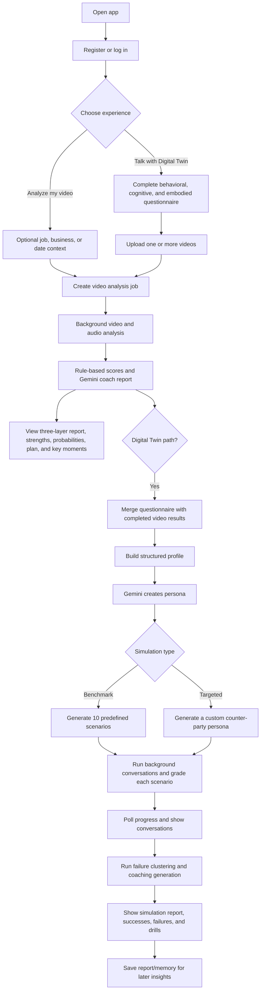
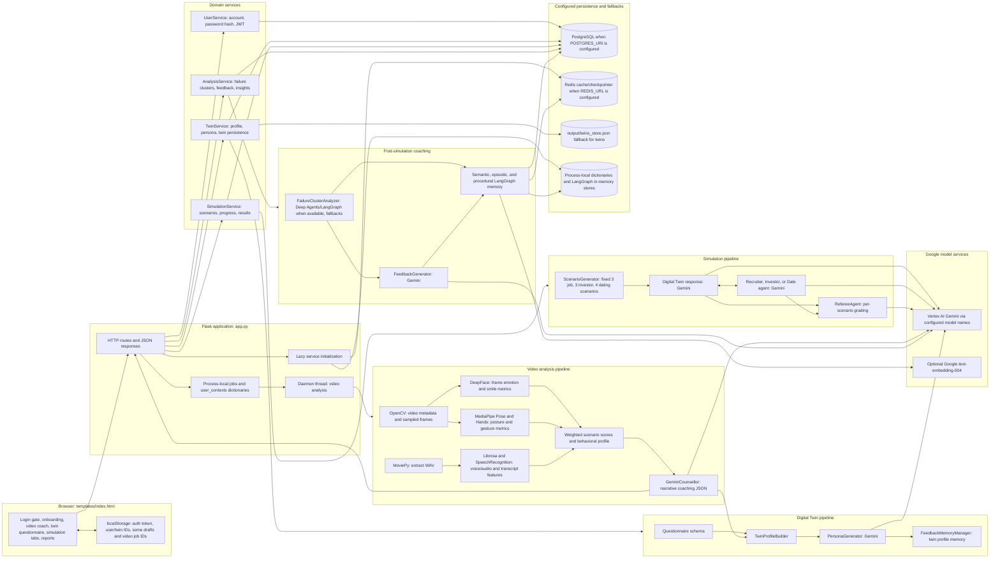
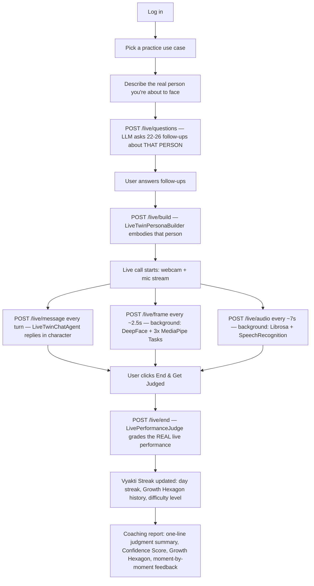

# HCA End-to-End Flow and Architecture

This document describes what the current codebase does from the user's first screen through video coaching, Digital Twin creation, simulation, and post-simulation feedback. It follows the Flask application in `app.py` and `templates/index.html`; it does not treat every aspiration in `architecture.md` as already implemented. It also covers the `live-video` branch's real-time Live Digital Twin call feature (see "Live Digital Twin — Real-Time Call" below), which is the branch currently deployed to production.

## At a Glance

The app has three connected experiences:

1. **Video communication coach:** analyzes one or more video uploads and returns a Gemini coaching report plus rule-based scores.
2. **Digital Twin simulator:** combines that video analysis with a behavioral, cognitive, and embodied self-assessment; Gemini builds the user's persona; the simulation service runs either 10 benchmark scenarios or one custom target-persona conversation; a separate analysis step groups outcomes and generates coaching feedback.
3. **Live Digital Twin (real-time call):** the user picks a practice use case, describes a real person they're about to face, answers follow-up questions, and then has an actual live webcam/mic conversation with an AI embodying that person — graded afterward on real, live-measured behavioral signals rather than a pre-recorded video.

The video analysis is a prerequisite for first-time Digital Twin creation. The initial coach report is available before simulation; simulation feedback is a later, separate report. The Live Digital Twin call (experience 3) does not require a pre-recorded video at all — it builds its persona purely from the user's free-text description and follow-up answers.

## User Journey

## System Architecture

## End-to-End Request Flow

### 1. Login and mode selection

The UI presents registration/login and then the onboarding choice. `/auth/register` and `/auth/login` call `UserService`; passwords are PBKDF2-HMAC hashed and successful login returns a JWT (or a development fallback token if PyJWT is unavailable). The browser keeps the token and user/twin IDs in `localStorage`. Twin and simulation routes require a bearer token; the video job routes themselves do not currently apply `require_auth`.

### 2. Video upload and analysis

Both the standalone video-coach experience and the Digital Twin video panel use the same analysis worker.

1. The browser calls `POST /init-job` to allocate a job ID.
2. In the coach experience, it optionally sends text context to `/save-context` and PDF/DOC/TXT context files to `/upload-context-file`.
3. It sends the video to `POST /upload`. The route accepts MP4, AVI, MOV, MKV, WEBM, FLV, and WMV up to 500 MB, saves the upload to a temporary file, and starts `_run_analysis` in a daemon thread.
4. The browser polls `GET /status/<job_id>`. When the job is done, it requests `GET /results/<job_id>`.
5. `_run_analysis` extracts metadata and sampled frames using OpenCV, extracts audio with MoviePy, then analyzes facial expressions, posture/hand gestures, and voice/speech. It computes weighted scores and a basic behavioral profile, then calls `GeminiCounsellor` for the narrative report.
6. The worker returns the result in the process-local `jobs` dictionary and deletes the temporary video and extracted WAV in its `finally` block.

The web upload path samples every 90th frame by default (about every three seconds at 30 FPS). The CLI path in `main.py` is separate and uses the configuration file/default settings.

### 3. Video analysis and initial coach report

The deterministic analyzers create measurable inputs; the counselor turns those inputs into a narrative report.

| Input path | Current implementation | Main outputs |
|---|---|---|
| Face | DeepFace emotion analysis over sampled frames | Emotion distribution/timeline, smile ratio, scenario scores |
| Body | MediaPipe Pose and Hand Landmarkers | Head/spine proxy, shoulder alignment, openness, crossed-arm/confidence proxies, hand visibility and gesture activity |
| Voice | Librosa plus SpeechRecognition | Pace, pitch, pauses, transcript and transcript-derived indicators when available |
| Score | Weighted calculation in `BehaviorAnalysisAgent` | Job interview, business deal, and date probabilities with score breakdowns |
| Coaching | Gemini counselor prompt | Three communication layers, strengths/weaknesses, scenario probabilities, improvement plan, key moments, and top priority |

The coach UI renders the report and can export it to PDF. The Gemini report is a model-generated interpretation of extracted signals; the probabilities are assessments, not validated real-world outcome guarantees.

### 4. Questionnaire and Digital Twin creation

The UI loads the public schema from `GET /twin/schema`. It contains three sections:

- **Behavioral model:** traits, introversion/extroversion, risk tendency, habits, communication/decision style, conflict response, self-described strengths and weaknesses.
- **Cognitive/decision model:** career ambition, dating preferences, risk tolerance, values, investment and negotiation style, stress response, work preferences, goals, and narrative answers.
- **Embodied self-assessment:** self-rated eye contact, posture, gestures, smile, voice confidence, plus nervous/confident tells and first-impression narrative.

When the user submits, the UI sends `POST /twin/create` with at least eight non-empty answers and one or more completed video job IDs. The route merges available analysis results, then `TwinProfileBuilder` creates `behavioral_model`, `cognitive_model`, and `embodied_model`. The video-derived model includes posture/gesture metrics, emotion/timeline, voice metrics, transcript, counselor assessment, and key moments where those values exist.

`PersonaGenerator` sends the structured profile to Gemini using `LLM_MODEL` (default `gemini-2.5-pro`). Its JSON result includes a persona summary, system prompt, personality dimensions, communication fingerprint, likely strengths/weaknesses, scenario behaviors, and embodied signal summary. `TwinService` stores the profile/persona and writes a profile to `FeedbackMemoryManager`.

### 5. Simulation options

**Benchmark mode** is the default. `ScenarioGenerator.generate_all()` creates 10 scenario records: three job interviews, three investor pitches, and four dates. Each record contains an archetype, opening prompt, curveball, closing prompt, and success criteria. The target personas are currently selected from static archetype lists and given variations; the code does not ask an LLM to generate 10 entirely new target personas at setup time.

**Targeted mode** uses the scenario description from the questionnaire. The UI calls `/twin/custom-persona` to generate a counter-party persona (optionally informed by generated scenario questions and answers), then starts `/simulation/begin` with `mode: "custom"`. A custom run uses the generated counter-party prompt and has a 50-response loop.

### 6. Simulation execution and grading

`POST /simulation/begin` verifies the twin and starts background work. `SimulationService` stores a running simulation record, then uses `SimulationLoop.run_batch()` for benchmark scenarios with `SIM_MAX_WORKERS` workers (default 5). The browser polls `GET /simulation/<sim_id>` and displays completed conversations and scores.

For each benchmark scenario, the active `run_single()` path executes 50 loop iterations. Each iteration generates one twin response; the first 49 iterations also generate a counter-party response. Stage labels progress from opening to reaction, curveball, pressure, and closing. A `RefereeAgent` then grades the conversation on alignment, friction, outcome, and overall score, and returns a success/partial-success/failure verdict plus key moments and improvement tags.

The simulation model name comes from `SIM_LLM_MODEL`, falling back to `LLM_MODEL`, then `gemini-2.5-pro`. The twin, counter-party, and referee use the configured Vertex AI client. Model calls are logged by `agent/token_logger.py`.

### Model and runtime configuration

| Setting | Used by | Current fallback / behavior |
|---|---|---|
| `COUNSELLOR_MODEL` | Video coaching report | Defaults to `gemini-2.5-pro` |
| `LLM_MODEL` | Twin persona, feedback/cluster analysis, default simulation model | Defaults to `gemini-2.5-pro` |
| `SIM_LLM_MODEL` | Twin dialogue, counter-party dialogue, referee | Falls back to `LLM_MODEL`, then `gemini-2.5-pro` |
| `VERTEX_PROJECT`, `VERTEX_LOCATION` | Gemini clients | Default to `ai-ml-integrations` and `us-central1` in these modules |
| `GOOGLE_APPLICATION_CREDENTIALS`, `GOOGLE_CREDENTIALS_JSON`, `GCP_*`, `GOOGLE_API_KEY` | Google client authentication | `app.py` supports a credentials file, JSON environment variable, individual service-account fields, or API-key fallback |
| `SIM_MAX_WORKERS` | Concurrent benchmark scenarios | Defaults to `5` |
| `POSTGRES_URI`, `REDIS_URL` | Optional persistence, caching, and LangGraph memory | Missing or unavailable services fall back to in-process storage where implemented |

The Flask web experience starts from `app.py`. `main.py` is a separate command-line entry point that loads `config.json` (or a supplied config), analyzes a local video, prints the report to the terminal, and can save text output under `output/`.

### 7. Post-simulation coaching and memory

After the simulation reaches `completed`, the UI automatically calls `POST /analysis/<sim_id>`.

1. `AnalysisService` gets the scenario results and twin persona.
2. `FailureClusterAnalyzer` computes/organizes patterns and uses Deep Agents/LangGraph when available, with fallback paths when optional components are unavailable. Its memory tools can retrieve the twin profile, prior episodes, and similar failure notes.
3. `FeedbackGenerator` turns the cluster report into a user-facing debrief: aggregate success statistics, category verdicts, failure breakdown, personality insights, a priority behavior change, and a 30-day practice plan.
4. `AnalysisService` returns the report and starts background persistence/memory updates. `GET /insights/<user_id>` exposes aggregated past coaching insights to the authenticated owner.

## Live Digital Twin — Real-Time Call (`live-video` branch)

This is a separate, self-contained flow from the benchmark/custom simulation above. It needs no pre-recorded video and no questionnaire; it runs an actual live webcam/mic conversation, analyzed as it happens.

### Phase-by-phase

| Phase | Route | Module | What happens |
|---|---|---|---|
| Use case selection | `GET /use-cases`, `GET /streak/<id>`, `GET /streak` | `agent/live/use_cases.py`, `agent/live/streak_manager.py` | User picks one of 10 domain use cases (job interviews, dating, boardrooms, crisis PR, medical consultations, etc.); each use case's current streak/level shows on its card |
| Describe → follow-ups | `POST /live/questions` | `agent/live/live_question_generator.py` (`LiveTwinQuestionGenerator`) | User free-types a description of the person they're about to face; Gemini generates 22-26 natural follow-up questions **about that person** (identity, personality, communication style, pressure points, decision-making style, non-verbal tendencies, stakes) |
| Build persona | `POST /live/build` | `agent/live/live_persona_builder.py` (`LiveTwinPersonaBuilder`) | Combines the description + answers (+ use-case context + current difficulty level) into a persona: name, role, personality, a live-roleplay `system_prompt` (short spoken-style turns), and an `opening_line` |
| Live conversation | `POST /live/message` | `agent/live/live_twin_chat.py` (`LiveTwinChatAgent`) | Generates the twin's next in-character reply, optionally colored by a live `behavior_hint` (e.g. "tense/closed posture; mostly neutral expression; speaking pace: fast") derived from the user's own measured signals so far |
| Live visual signal capture | `POST /live/frame` (fire-and-forget, ~every 2.5s) | `agent/live/live_session_manager.py` → `agent/live/live_behavior_tracker.py` → `agent/analyzers/facial_expression.py`, `body_language.py`, `face_landmark_analyzer.py` | DeepFace (emotion, mtcnn detector) + MediaPipe Pose/Hand/FaceLandmarker Tasks analyze each frame: posture, openness, confidence signals, hand gesture activity, emotion distribution/smile ratio, eyebrow blendshapes |
| Live voice signal capture | `POST /live/audio` (fire-and-forget, ~every 7s) | same tracker → `agent/analyzers/voice_speech.py` | Librosa (pitch/energy/pace/pauses) + SpeechRecognition (transcript, filler words) per audio chunk; transcript fragments accumulate for the final transcript |
| End & judge | `POST /live/end` | `agent/live/live_judge.py` (`LivePerformanceJudge`) | Grades the REAL conversation: full transcript + aggregated behavioral signals + a turn-by-turn breakdown (what the user's face/posture/eyebrows were doing at each of their turns) → one-line fit summary, 7 per-dimension 1-10 scores, Growth Hexagon (6 axes), moment-by-moment facial/eyebrow/posture notes, strengths/areas to improve/best-worst moment/coaching tips |
| Vyakti Streak | (invoked from `/live/end`) | `agent/live/streak_manager.py` (`VyaktiStreakManager`) | Per `(user_id, use_case_id)`: day-streak tracking, rolling Growth Hexagon history, and algorithmic difficulty scaling — Level 1 Novice → Level 2 Neutral → Level 3 Hostile/Mastery, auto-graduating after a sustained streak **and** an average Confidence Score ≥ 55, awarding a use-case-specific badge (e.g. "Boardroom Ready", "Pitch Perfect") |

### Use Case Library and difficulty scaling

`agent/live/use_cases.py` defines 10 fixed use cases (dating, job interviews, girlfriend/parent conversations, regulatory audits, medical consultations, VC pitching, crisis PR, diplomatic negotiation, corporate boardrooms), each carrying a `context_prompt` (layered into persona building) and a `judge_focus` (layered into judging) — the underlying dynamic persona/question/judge pipeline itself is unchanged per use case, only these two focused instruction blocks differ.

The same file also defines `TWIN_LEVELS` (1=Novice, 2=Neutral, 3=Hostile/Mastery): each level sets a target `openness_level`/`pressure_level` (1-10) and a behavior instruction appended to the persona's `system_prompt` (e.g. Novice twins give gentle hints and stay patient; Hostile twins interrupt rambling, push back hard, and test composure). The active level comes from the user's current Vyakti Streak for that use case.

### Scoring shown in the coaching report

- **One-line judgment summary** (`situation_fit_summary`): the judge LLM's qualitative read on whether the user's approach fit the specific situation. Shown as plain text, no numeric score alongside it (the numeric "X/10 — verdict" score was removed from the UI — showing it next to the Confidence Score confused users even once the two were made numerically consistent).
- **Vyakti Confidence Score (0-100)**: deterministic, not a second free-floating LLM number — computed server-side as the average of the 7 per-dimension 1-10 scores (voice & tone, posture & body language, facial expressions, eyebrows & micro-expressions, confidence, talking quality, hand movements), ×10. This was a real bug fix: the judge LLM reliably confused this field's 0-100 scale with the 1-10 scale used everywhere else in its own JSON schema (e.g. emitting `5` instead of `~50`), so the number is now always recomputed server-side rather than trusted from the model.
- **Growth Hexagon (6 axes)**: composure under pressure, vocal resonance/control, posture & openness, facial congruence, conciseness & clarity, active listening markers — tracked per use case across sessions via the Vyakti Streak's rolling history.

### Operational characteristics (single-process, 4-vCPU deployment)

- **In-memory, process-local sessions.** `LiveTwinSessionManager._sessions` is a plain Python dict keyed by a 12-char session id; it does not survive a process restart (no Postgres/Redis path for live sessions, unlike twins/simulations/analysis documents above).
- **Single gunicorn worker is required.** Job/user/simulation AND live-session state all live in this same kind of process-local dict, so the deployed Supervisor config is pinned to `--workers 1` (with `--threads 8` for concurrency) — running more worker processes would scatter session state across processes and break everything from status polling to live calls.
- **`/live/frame` and `/live/audio` are genuinely asynchronous at the server, not just by convention.** A single frame's full analysis (DeepFace + 3 sequential MediaPipe Tasks models) measured 10-200+ seconds under load on this 4-vCPU box — far longer than the browser's ~2.5s capture interval. Running that synchronously inside the request handler blocked a shared worker-thread-pool slot long enough to starve `/live/message` entirely in some sessions (confirmed via telemetry: an entire live call with zero completed `LiveTwinChatAgent` calls). Both routes now hand the actual analysis off to a dedicated background thread per session, returning immediately; `ingest_frame()` additionally drops any frame that arrives while one is already being processed (a stale sample is acceptable for coaching averages, an ever-growing backlog is not), while `ingest_audio()` processes every chunk (losing spoken words is not acceptable).
- **Native library thread pools are capped to 1.** TensorFlow (DeepFace)/OpenCV/numpy's BLAS backend each try to use all available CPU cores for their own internal thread pool by default; with 8 concurrent gthread workers this oversubscribed the VPS's 4 vCPUs badly. `OMP_NUM_THREADS`, `OPENBLAS_NUM_THREADS`, `MKL_NUM_THREADS`, `TF_NUM_INTRAOP_THREADS`, `TF_NUM_INTEROP_THREADS`, and `cv2.setNumThreads(1)` are all forced to 1 so Python-level thread concurrency is the only parallelism in play.
- **App-wide numpy-safe JSON responses.** DeepFace returns emotion scores as `numpy.float32`, which the default JSON encoder cannot serialize — this previously hard-crashed every `/live/end` response once DeepFace was actually working. `app.py` installs a custom Flask JSON provider that coerces any stray `numpy` scalar/array to a native Python type before serializing, as a safety net beyond casting at the analyzer source.
- **Browser-side TTS reliability.** Twin replies are spoken via `speechSynthesis.speak()`; a known Chrome bug can garbage-collect an utterance mid-speech if nothing keeps a reference to it. The client keeps a persistent reference and calls `speechSynthesis.cancel()` before each new utterance to clear any stuck queue state, with error logging instead of a silently swallowed failure.

## Data and Persistence Boundaries

| Data | Current location / behavior |
|---|---|
| Uploaded video and extracted audio | Temporary files; deleted when video analysis finishes or fails |
| Video job status/results and user context | Flask process memory (`jobs`, `user_contexts`); not durable across process restart |
| User accounts | PostgreSQL when `POSTGRES_URI` is set; otherwise process-memory dictionaries |
| Twins | PostgreSQL when configured; otherwise process-memory dictionary plus `output/twins_store.json` |
| Simulation records/results | PostgreSQL when configured; otherwise process memory; active/progress values also use `RedisCache` |
| Analysis documents | PostgreSQL when configured; otherwise process memory; cached by `RedisCache` |
| Feedback memory | Redis/Postgres LangGraph checkpointer when configured and available; otherwise `InMemorySaver`; long-term store uses `PostgresStore` or `InMemoryStore` (optionally with embeddings) |
| Pinecone/Weaviate wrapper | Implemented in `agent/memory/vector_store.py`, but not currently constructed or called by the app's twin/feedback flow |
| Live Digital Twin sessions | Flask process memory only (`agent/live/live_session_manager.py`'s `_sessions` dict); no Postgres/Redis path — not durable across a restart, same caveat as video jobs above |
| Vyakti Streak (live-call gamification) | `output/vyakti_streaks.json` (loaded into an in-memory dict at startup, rewritten on every recorded session) — the only live-call data that persists across a restart |

The short-term LangGraph checkpointer and long-term LangGraph store are distinct from the standalone `RedisCache` and the Pinecone/Weaviate wrapper. A Redis or PostgreSQL fallback in one of these components does not make process-local job state durable.

## Route Map

| Area | Routes used by the UI | Purpose |
|---|---|---|
| Video coach | `/init-job`, `/save-context`, `/upload-context-file`, `/upload`, `/status/<job_id>`, `/results/<job_id>` | Prepare context, upload, poll, and retrieve analysis |
| Auth | `/auth/register`, `/auth/login` | Register and authenticate |
| Twin | `/twin/schema`, `/twin/create`, `/twin/me`, `/twin/<twin_id>`, `/twin/update` | Load questionnaire and manage Digital Twin |
| Targeted preparation | `/twin/scenario-questions`, `/twin/custom-persona` | Generate scenario-specific questions and counter-party persona |
| Simulation | `/simulation/begin`, `/simulation/<sim_id>`, `/simulation/<sim_id>/step/<step>`, `/simulation/<sim_id>/results` | Start, poll, and read simulation outcomes |
| Coaching | `/analysis/<sim_id>`, `/analysis/get/<analysis_id>`, `/insights/<user_id>` | Generate/retrieve debrief and user insights |
| Live Digital Twin | `/use-cases`, `/streak/<use_case_id>`, `/streak`, `/live/questions`, `/live/build`, `/live/message`, `/live/frame`, `/live/audio`, `/live/end`, `/live/session/<session_id>` | Use-case/streak lookup, describe→follow-ups→build→live chat→judge for the real-time call |
| Diagnostics | `/admin/runs/<run_id>/telemetry`, `/admin/token-usage` | Inspect telemetry and model usage (authentication required) |

## Current Scope and Important Gaps

These distinctions matter when interpreting the UI and the existing architecture notes:

- **The benchmark is 10 scenarios, not 1,000.** Each benchmark scenario currently runs 50 twin response iterations (and 49 counter-party replies); it does not generate a thousand scenarios.
- **The four-stage LangGraph graph is not the benchmark execution path.** `SimulationLoop` builds an opening/reaction/curveball/closing graph, but `run_batch()` calls `run_single()`, which executes `_extended_run()` instead. The normal benchmark therefore follows the longer 50-iteration loop, including a pressure stage.
- **The target profiles are archetype templates.** The 10 benchmark counter-parties use static archetype data plus variations; the LLM generates their dialogue, not a new target-persona profile for each benchmark at scenario-generation time.
- **Pinecone/Weaviate evaluation is latency-only in the wrapper.** `VectorMemoryStore` can select the faster available service from a single latency check, but it does not measure retrieval accuracy, and current app services do not wire that class into the memory flow.
- **Dataset files are not used for training by the runtime.** The current application code does not load the `datasets/` contents into a training or inference pipeline. `download_coco.py` is a dataset download/export utility.
- **OpenPose is not the active pose analyzer.** The web analysis imports MediaPipe Tasks Pose and Hand Landmarkers. The `external_repos/openpose` folder is not imported in the application path.
- **Eye contact and micro-expression claims need care.** The questionnaire collects self-reported eye contact, but the video pipeline does not calculate gaze/eye-contact tracking. DeepFace classifies sampled-frame emotion; it is not a dedicated micro-expression model. Posture/spine/confidence values are landmark-derived proxies.
- **The browser contains draft and stop requests without matching Flask routes.** The UI calls `/twin/draft` and `/simulation/<sim_id>/stop`, but `app.py` does not register those endpoints; those actions currently cannot complete through the shown backend.
- **Job data is process-local and video routes are unauthenticated.** Do not assume a video job survives a restart or that `/upload` and `/results/<job_id>` enforce account ownership; only the twin/simulation/coaching route groups use the auth decorator in the current code.
- **Live Digital Twin sessions are process-local too, and require a single gunicorn worker.** `/live/*` session state lives in the same kind of in-memory dict as video jobs — it does not survive a restart, and the deployment is pinned to one worker process so this state isn't scattered across processes.
- **Live frame analysis intentionally drops frames under load.** `/live/frame` keeps only the most recently received frame per session and discards any that arrive while a prior one is still being analyzed — the coaching signal is a rolling average, not a frame-complete record of the call, by design.

## Main Code Map

| Concern | Main files |
|---|---|
| Flask routes, job lifecycle, model credential setup | `app.py` |
| Browser onboarding, video flows, questionnaire, simulation, report views | `templates/index.html` |
| Video decoding | `agent/video_processor.py` |
| Video analysis, weighted scores, behavioral profile | `agent/behavior_agent.py`, `agent/analyzers/` |
| Gemini video coach | `agent/analyzers/gemini_counsellor.py` |
| Twin questionnaire, profile, persona | `agent/twin/form_schema.py`, `agent/twin/profile_builder.py`, `agent/twin/persona_generator.py` |
| User, twin, simulation, feedback services | `services/user_service.py`, `services/twin_service.py`, `services/simulation_service.py`, `services/analysis_service.py` |
| Scenario generation, counter-parties, simulation, referee | `agent/simulation/scenario_generator.py`, `agent/simulation/counter_agents.py`, `agent/simulation/simulation_loop.py`, `agent/simulation/referee.py` |
| Failure analysis, feedback, and LangGraph memory | `agent/feedback/cluster_analyzer.py`, `agent/feedback/feedback_generator.py`, `agent/feedback/memory_manager.py` |
| Optional standalone cache/vector DB adapters | `agent/memory/redis_cache.py`, `agent/memory/vector_store.py` |
| Live Digital Twin: session orchestration, question/persona generation, live chat, judging, use cases, streaks | `agent/live/live_session_manager.py`, `agent/live/live_question_generator.py`, `agent/live/live_persona_builder.py`, `agent/live/live_twin_chat.py`, `agent/live/live_behavior_tracker.py`, `agent/live/live_judge.py`, `agent/live/use_cases.py`, `agent/live/streak_manager.py` |
