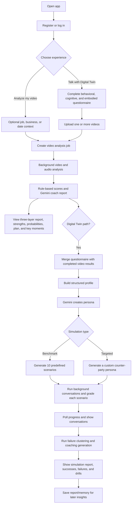
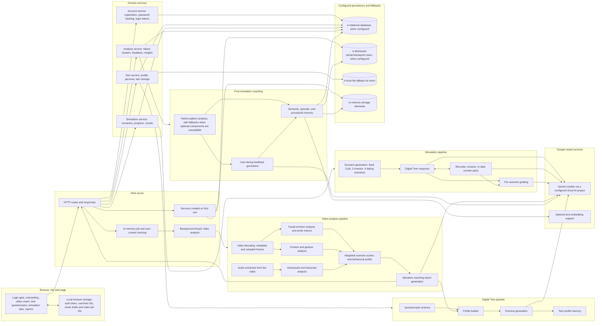
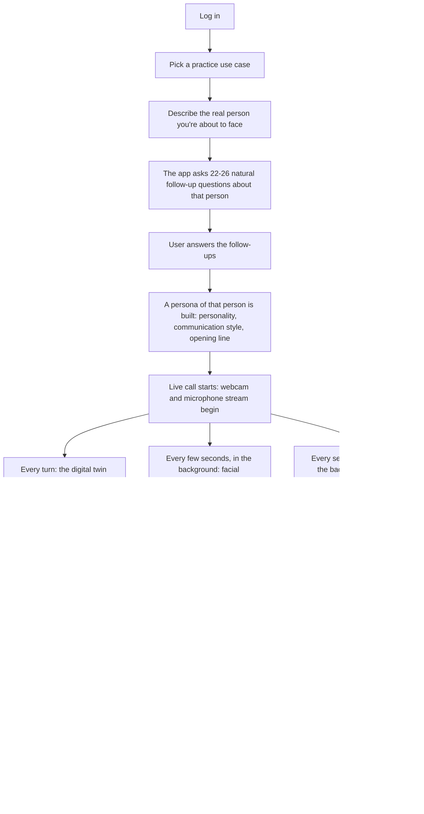

# HCA End-to-End Flow and Architecture

This document describes what the current codebase does from the user's first screen through video coaching, Digital Twin creation, simulation, and post-simulation feedback. It follows the web application and its browser-side pages; it does not treat every aspiration in the separate high-level architecture notes as already implemented. It also covers the real-time Live Digital Twin call feature described further below, which is the version currently deployed to production.

## At a Glance

The app has three connected experiences:

1. **Video communication coach:** analyzes one or more video uploads and returns a Gemini coaching report plus rule-based scores.
2. **Digital Twin simulator:** combines that video analysis with a behavioral, cognitive, and embodied self-assessment; Gemini builds the user's persona; the simulation service runs either 10 benchmark scenarios or one custom target-persona conversation; a separate analysis step groups outcomes and generates coaching feedback.
3. **Live Digital Twin (real-time call):** the user picks a practice use case, describes a real person they're about to face, answers follow-up questions, and then has an actual live webcam/mic conversation with an AI embodying that person — graded afterward on real, live-measured behavioral signals rather than a pre-recorded video.

The video analysis is a prerequisite for first-time Digital Twin creation. The initial coach report is available before simulation; simulation feedback is a later, separate report. The Live Digital Twin call (experience 3) does not require a pre-recorded video at all — it builds its persona purely from the user's free-text description and follow-up answers.

## User Journey

## System Architecture

## End-to-End Request Flow

### 1. Login and mode selection

The UI presents registration/login and then the onboarding choice. Registration and login are handled by the account service; passwords are hashed with a strong, salted algorithm, and successful login returns an authentication token (or a development fallback token if the standard token library isn't available). The browser keeps the token and user/twin IDs in local browser storage. Twin and simulation routes require that authentication token; the video job routes themselves do not currently enforce it.

### 2. Video upload and analysis

Both the standalone video-coach experience and the Digital Twin video panel use the same analysis worker.

1. The browser calls a route to allocate a job ID.
2. In the coach experience, it optionally sends text context and PDF/DOC/TXT context files.
3. It uploads the video. The route accepts MP4, AVI, MOV, MKV, WEBM, FLV, and WMV up to 500 MB, saves the upload to a temporary file, and starts the analysis step in a background thread.
4. The browser polls a status route. When the job is done, it requests the results.
5. The background analysis step extracts metadata and sampled frames, extracts the audio track, then analyzes facial expressions, posture/hand gestures, and voice/speech. It computes weighted scores and a basic behavioral profile, then generates the narrative coaching report.
6. The worker returns the result in an in-memory job registry and deletes the temporary video and extracted audio once finished, whether or not it succeeded.

The web upload path samples every 90th frame by default (about every three seconds at 30 FPS). A separate command-line tool exists for analyzing a local video file directly from a terminal, using its own configuration file or defaults.

### 3. Video analysis and initial coach report

The deterministic analyzers create measurable inputs; the counselor turns those inputs into a narrative report.

| Input path | Current implementation | Main outputs |
|---|---|---|
| Face | DeepFace emotion analysis over sampled frames | Emotion distribution/timeline, smile ratio, scenario scores |
| Body | MediaPipe Pose and Hand Landmarkers | Head/spine proxy, shoulder alignment, openness, crossed-arm/confidence proxies, hand visibility and gesture activity |
| Voice | Librosa plus SpeechRecognition | Pace, pitch, pauses, transcript and transcript-derived indicators when available |
| Score | A weighted scoring step combining all of the above | Job interview, business deal, and date probabilities with score breakdowns |
| Coaching | Gemini counselor prompt | Three communication layers, strengths/weaknesses, scenario probabilities, improvement plan, key moments, and top priority |

The coach UI renders the report and can export it to PDF. The Gemini report is a model-generated interpretation of extracted signals; the probabilities are assessments, not validated real-world outcome guarantees.

### 4. Questionnaire and Digital Twin creation

The UI loads the public questionnaire schema from a dedicated route. It contains three sections:

- **Behavioral model:** traits, introversion/extroversion, risk tendency, habits, communication/decision style, conflict response, self-described strengths and weaknesses.
- **Cognitive/decision model:** career ambition, dating preferences, risk tolerance, values, investment and negotiation style, stress response, work preferences, goals, and narrative answers.
- **Embodied self-assessment:** self-rated eye contact, posture, gestures, smile, voice confidence, plus nervous/confident tells and first-impression narrative.

When the user submits, the UI sends the answers (at least eight non-empty) along with one or more completed video job IDs. The route merges available analysis results, then a profile-building step creates the behavioral, cognitive, and embodied models. The video-derived model includes posture/gesture metrics, emotion/timeline, voice metrics, transcript, counselor assessment, and key moments where those values exist.

The structured profile is then sent to the configured Gemini model (Gemini 2.5 Pro by default) to generate a persona. Its result includes a persona summary, system prompt, personality dimensions, communication fingerprint, likely strengths/weaknesses, scenario behaviors, and embodied signal summary. The twin service stores the profile/persona and writes a profile into the long-term feedback memory.

### 5. Simulation options

**Benchmark mode** is the default. A scenario-generation step creates 10 scenario records: three job interviews, three investor pitches, and four dates. Each record contains an archetype, opening prompt, curveball, closing prompt, and success criteria. The target personas are currently selected from static archetype lists and given variations; the code does not ask an LLM to generate 10 entirely new target personas at setup time.

**Targeted mode** uses the scenario description from the questionnaire. The UI requests a generated counter-party persona (optionally informed by generated scenario questions and answers), then starts the simulation in custom mode. A custom run uses the generated counter-party prompt and has a 50-response loop.

### 6. Simulation execution and grading

Starting a simulation verifies the twin and starts background work. The simulation service stores a running simulation record, then runs the benchmark scenarios concurrently, with a configurable worker limit (5 by default). The browser polls a status route and displays completed conversations and scores.

For each benchmark scenario, the active path executes 50 loop iterations. Each iteration generates one twin response; the first 49 iterations also generate a counter-party response. Stage labels progress from opening to reaction, curveball, pressure, and closing. A referee step then grades the conversation on alignment, friction, outcome, and overall score, and returns a success/partial-success/failure verdict plus key moments and improvement tags.

The simulation uses a separately configurable model, falling back to the same default Gemini model used elsewhere if not set. The twin, counter-party, and referee all use the same configured cloud AI project. Every model call is logged for cost and usage tracking.

### Model and runtime configuration

| Setting | Used by | Current fallback / behavior |
|---|---|---|
| Coaching model | Video coaching report | Defaults to Gemini 2.5 Pro |
| General-purpose model | Twin persona, feedback/cluster analysis, default simulation model | Defaults to Gemini 2.5 Pro |
| Simulation-specific model | Twin dialogue, counter-party dialogue, referee | Falls back to the general-purpose model, then Gemini 2.5 Pro |
| Cloud project and region | Gemini clients | Default to a preconfigured project and region in these modules |
| Google credentials (file path, inline JSON blob, individual service-account fields, or a plain API key) | Google client authentication | The web server supports any of these forms, trying each in turn |
| Concurrent benchmark workers | Concurrent benchmark scenarios | Defaults to 5 |
| Database and cache connection settings | Optional persistence, caching, and long-term memory | Missing or unavailable services fall back to in-process storage where implemented |

The web experience starts from the main server entry point. A separate command-line entry point loads a configuration file (or a supplied one), analyzes a local video, prints the report to the terminal, and can save text output to a local output folder.

### 7. Post-simulation coaching and memory

After the simulation reaches a completed state, the UI automatically requests the post-simulation analysis.

1. The analysis service gets the scenario results and twin persona.
2. A failure-pattern analysis step computes/organizes patterns, using more advanced reasoning/memory tooling when available, with fallback paths when optional components are unavailable. Its memory tools can retrieve the twin profile, prior episodes, and similar failure notes.
3. A feedback-generation step turns the cluster report into a user-facing debrief: aggregate success statistics, category verdicts, failure breakdown, personality insights, a priority behavior change, and a 30-day practice plan.
4. The analysis service returns the report and starts background persistence/memory updates. A separate route exposes aggregated past coaching insights to the authenticated owner.

## Live Digital Twin — Real-Time Call (`live-video` branch)

This is a separate, self-contained flow from the benchmark/custom simulation above. It needs no pre-recorded video and no questionnaire; it runs an actual live webcam/mic conversation, analyzed as it happens.

### Phase by phase

**1. Use case selection.** Right after logging in, the user picks one of ten domain scenarios — job interviews, dating, a difficult conversation with a girlfriend or parents, regulatory audits, medical consultations, venture-capital pitching, crisis PR interviews, diplomatic negotiation, or corporate boardrooms. Each scenario card shows the user's current streak and difficulty level for that specific use case.

**2. Describing the person.** The user freely types who they are about to face — a recruiter, an investor, a date, a difficult boss. The app sends this description to Gemini, which responds with 22 to 26 natural, conversational follow-up questions about that specific person: their personality, communication style, attitude, values, pet peeves, decision-making style, body language tendencies, and what's at stake for them in this interaction. The questions are about the other person, not about the user.

**3. Building the persona.** Once the user answers those follow-ups, everything collected — the description, the answers, the chosen use case's context, and the user's current difficulty level — is sent to Gemini again, which designs a persona: a name, a role, a personality summary, a communication style, and a detailed instruction describing how that person should talk and react during a live, spoken conversation (short, natural turns, never breaking character). It also writes the very first line the persona will say when the call begins.

**4. The live conversation.** The webcam and microphone turn on. Every time the user speaks or types a reply, it is sent to the model, which answers back in character, subtly adjusted by a live read of how the user is coming across (for example, tense posture, a mostly neutral expression, or a fast speaking pace) so the persona reacts the way a real person subconsciously would.

**5. Live behavioral signal capture.** While the conversation is happening, the app is also quietly analyzing the user in the background:
   - Every few seconds, a video frame is captured and analyzed for facial expression and emotion, posture and openness, confidence signals, hand gesture activity, and eyebrow movement.
   - Every several seconds, a short audio clip is captured and analyzed for pitch, energy, speaking pace, pauses, and a running transcript of what was said.
   
   Both of these run in the background rather than blocking the conversation — if a frame takes too long to analyze, it's simply dropped in favor of a fresher one, since a slightly stale behavioral sample doesn't hurt the coaching average. Spoken audio is never dropped, since losing someone's actual words would be unacceptable.

**6. Ending the call and judging performance.** When the user clicks "End & Get Judged," a neutral judge model reviews the full transcript, every aggregated behavioral signal from the call, and a turn-by-turn breakdown of what the user's face, posture, and eyebrows were doing at each of their own turns. It produces a short written verdict on how well the user's approach fit the situation, a score for each of seven performance dimensions, a six-axis "growth" profile, specific moment-by-moment notes on what went right or wrong, and concrete coaching tips.

**7. Streak and progression.** Each completed call updates the user's streak for that specific use case: consecutive days practiced, a rolling history of their six-axis growth scores, and an automatic difficulty upgrade — from a patient, encouraging opponent, to a neutral and professional one, to a demanding, interruption-prone one that actively tests composure — once the user sustains a streak at a strong enough performance level. Reaching the hardest tier unlocks a use-case-specific badge (for example, "Boardroom Ready" or "Pitch Perfect").

### Scoring shown in the coaching report

- **One-line judgment summary:** a short, qualitative read from the judge on whether the user's overall approach fit the specific situation they described. It is shown as plain text, without a numeric score next to it — showing a second, differently-scaled number alongside the Confidence Score was confusing even after the two were made consistent with each other.
- **Vyakti Confidence Score (0–100):** a single composite number. Rather than trusting a second, independently generated number from the model (which was found to reliably confuse its own 0–100 scale with the 1–10 scale used for every other score, a real bug that has since been fixed), this score is now always calculated directly from the average of the seven individual performance-dimension scores, scaled up to 100.
- **Growth Hexagon (six axes):** composure under pressure, vocal tone and control, posture and openness, how well facial expression matched the conversation's tone, conciseness and clarity, and active-listening behavior — tracked over time, per use case, as part of the user's ongoing streak.

### How this holds up in production

- **Everything about an in-progress call lives only in server memory** while the call is happening — it does not survive a server restart, the same way an in-progress video-analysis job does not. A separate small file on disk does persist each user's streak history across restarts.
- **The server intentionally runs as a single process,** because conversation, job, and call state all live in that same in-memory fashion; running multiple processes would scatter a single user's session across them unpredictably.
- **Frame and audio analysis happen fully in the background**, not as part of the request that the browser is waiting on. Earlier, a single frame's full analysis (checking facial expression, posture, hands, and eyebrows together) could take anywhere from several seconds to several minutes under load — far longer than how often the browser was sending new frames — which blocked the shared pool of request-handling capacity badly enough that live chat replies would occasionally never arrive in time at all. Moving this analysis fully off the request path, and deliberately dropping a stale frame rather than queuing it, fixed that.
- **The underlying machine-learning libraries used for this analysis are explicitly limited to one thread each,** since by default they each try to use every available processor core on their own — running several of them at once, per request, on a modest server quickly overwhelmed it and made everything slower, not faster.
- **Responses are protected against a data-type serialization bug** where the facial-emotion analysis library occasionally returns numbers in a format the web framework's default response encoder cannot handle, which used to crash the very last step of every call (the final judgment) once that analysis path was actually working correctly. A safety net was added so this class of error can no longer take down a response.
- **Spoken replies from the digital twin are read aloud in the browser.** A known browser quirk can silently cut off that spoken audio partway through if nothing keeps it "alive" for its full duration; this is now guarded against, along with basic logging so a future failure of this kind is visible instead of silent.

## Data and Persistence Boundaries

| Data | Current location / behavior |
|---|---|
| Uploaded video and extracted audio | Temporary files; deleted when video analysis finishes or fails |
| Video job status/results and user context | In-memory only; not durable across a process restart |
| User accounts | A relational database when configured; otherwise in-memory only |
| Twins | A relational database when configured; otherwise an in-memory record plus a local file fallback |
| Simulation records/results | A relational database when configured; otherwise in-memory; active/progress values also use a distributed cache when available |
| Analysis documents | A relational database when configured; otherwise in-memory; cached by the same distributed cache when available |
| Feedback memory | A distributed cache or database-backed checkpoint store when configured and available; otherwise an in-memory equivalent; the long-term store works the same way, optionally with text embeddings |
| A vector-database wrapper | Implemented but not currently constructed or called by the app's twin/feedback flow |
| Live Digital Twin sessions | In-memory only, keyed by a short session id; no database path — not durable across a restart, same caveat as video jobs above |
| Vyakti Streak (live-call gamification) | A small local file on disk (loaded into memory at startup, rewritten on every recorded session) — the only live-call data that persists across a restart |

The short-term and long-term memory stores used for feedback are distinct from the standalone distributed cache and the vector-database wrapper mentioned above. A fallback in one of these components does not make in-memory job state durable.

## Route Map

| Area | Routes used by the UI | Purpose |
|---|---|---|
| Video coach | `/init-job`, `/save-context`, `/upload-context-file`, `/upload`, `/status/<job_id>`, `/results/<job_id>` | Prepare context, upload, poll, and retrieve analysis |
| Auth | `/auth/register`, `/auth/login` | Register and authenticate |
| Twin | `/twin/schema`, `/twin/create`, `/twin/me`, `/twin/<twin_id>`, `/twin/update` | Load questionnaire and manage Digital Twin |
| Targeted preparation | `/twin/scenario-questions`, `/twin/custom-persona` | Generate scenario-specific questions and counter-party persona |
| Simulation | `/simulation/begin`, `/simulation/<sim_id>`, `/simulation/<sim_id>/step/<step>`, `/simulation/<sim_id>/results` | Start, poll, and read simulation outcomes |
| Coaching | `/analysis/<sim_id>`, `/analysis/get/<analysis_id>`, `/insights/<user_id>` | Generate/retrieve debrief and user insights |
| Live Digital Twin | `/use-cases`, `/streak/<use_case_id>`, `/streak`, `/live/questions`, `/live/build`, `/live/message`, `/live/frame`, `/live/audio`, `/live/end`, `/live/session/<session_id>` | Use-case/streak lookup, describe→follow-ups→build→live chat→judge for the real-time call |
| Diagnostics | `/admin/runs/<run_id>/telemetry`, `/admin/token-usage` | Inspect telemetry and model usage (authentication required) |

## Current Scope and Important Gaps

These distinctions matter when interpreting the UI and the existing architecture notes:

- **The benchmark is 10 scenarios, not 1,000.** Each benchmark scenario currently runs 50 twin response iterations (and 49 counter-party replies); it does not generate a thousand scenarios.
- **The longer, four-stage graph of reasoning steps is not the benchmark execution path.** A separate opening/reaction/curveball/closing graph exists, but the actual benchmark path executes the longer 50-iteration loop described above, including a pressure stage.
- **The target profiles are archetype templates.** The 10 benchmark counter-parties use static archetype data plus variations; the LLM generates their dialogue, not a new target-persona profile for each benchmark at scenario-generation time.
- **The alternative vector-database evaluation is latency-only.** It can select the faster available service from a single latency check, but it does not measure retrieval accuracy, and current app services do not wire that option into the memory flow.
- **Dataset files are not used for training by the runtime.** The current application code does not load the bundled datasets into a training or inference pipeline; a separate utility only downloads/exports one of them.
- **An older open-source pose library is not the active pose analyzer.** The web analysis uses a newer pose and hand landmark pipeline instead; the older library is present in the repository but not imported in the application path.
- **Eye contact and micro-expression claims need care.** The questionnaire collects self-reported eye contact, but the video pipeline does not calculate gaze/eye-contact tracking. The facial-emotion step classifies sampled-frame emotion; it is not a dedicated micro-expression model. Posture/spine/confidence values are landmark-derived proxies.
- **The browser contains draft and stop requests without matching server routes.** The UI calls a draft-saving route and a stop-simulation route that the server does not register; those actions currently cannot complete through the shown backend.
- **Job data is in-memory only and video routes are unauthenticated.** Do not assume a video job survives a restart or that the upload/results routes enforce account ownership; only the twin/simulation/coaching route groups use the authentication check in the current code.
- **Live Digital Twin sessions are in-memory too, and require a single web-server process.** Live-call session state lives in the same kind of in-memory tracking as video jobs — it does not survive a restart, and the deployment is pinned to one process so this state isn't scattered across processes.
- **Live frame analysis intentionally drops frames under load.** The frame-ingestion route keeps only the most recently received frame per session and discards any that arrive while a prior one is still being analyzed — the coaching signal is a rolling average, not a frame-complete record of the call, by design.

## Where Things Live

Rather than list individual files, here is a plain-English map of which conceptual area of the codebase is responsible for what:

- **The web server and page templates** handle every HTTP route, the job lifecycle for video analysis, and model/credential setup; the browser-side page contains the onboarding flow, video coaching UI, questionnaire, simulation tabs, live-call UI, and all report views.
- **The video analysis pipeline** handles video decoding, frame sampling, audio extraction, facial-emotion analysis, posture/gesture analysis, voice/speech analysis, the weighted scoring step, and the narrative coaching report generation.
- **The Digital Twin pipeline** holds the questionnaire schema, the profile-building step that turns a questionnaire plus video results into structured models, and the persona-generation step.
- **The domain service layer** covers account management, twin storage, simulation orchestration, and post-simulation feedback/analysis.
- **The simulation pipeline** covers scenario generation, the counter-party roleplay step, the simulation loop itself, and the referee grading step.
- **The post-simulation coaching layer** covers failure-pattern analysis, feedback generation, and the semantic/episodic/procedural memory used to recall past sessions.
- **Optional standalone adapters** exist for a distributed cache and for an alternative vector database, independent of the main persistence path above.
- **The Live Digital Twin call feature** has its own self-contained area covering session orchestration, the follow-up question generator, the persona builder, the live chat step, the background behavioral-signal tracker, the end-of-call judge, the use-case library, and the streak/progression tracker.
